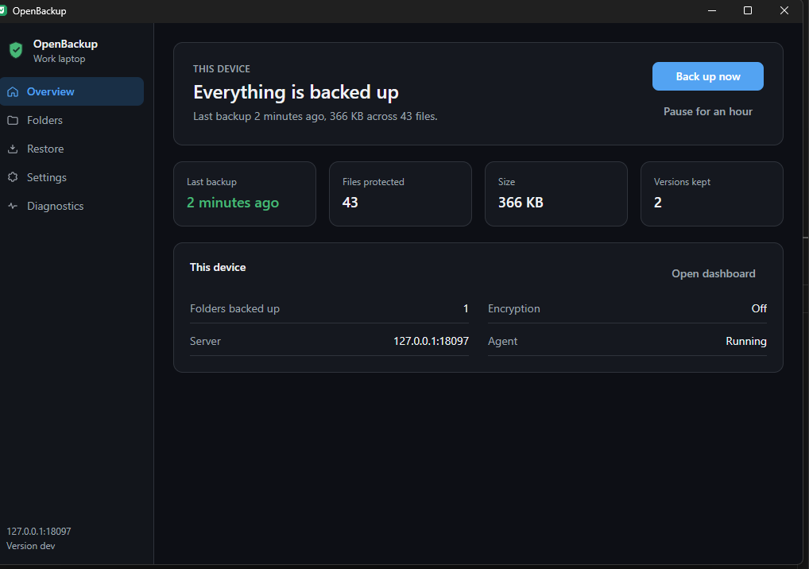

# OpenBackup

**Back up your files to a small computer in the cloud that *you* rent — not to Google, Dropbox, or anyone else’s company.**

Install once on a cheap VPS. On your PC or Mac, connect with one short code. After that it quietly backs up your documents, photos, videos, and desktop. When something goes wrong — deleted file, broken laptop — you get your files back.

Free. Open source (MIT). No subscription. Nothing phones home.

---

## Why we built this

Most people need a backup, but the choices feel bad:

| Option | The catch |
| --- | --- |
| Google Drive / Dropbox / iCloud | Monthly fee, *their* computers, *their* rules |
| “Pro” backup software | Complicated schedules, jargon, easy to set up wrong |
| Copying to a USB drive | Easy to forget — until the day you need it |

We wanted something in the middle:

- **Your** server (you rent a small VPS — a few dollars a month)
- **Almost no setup** — one command on the server, one code on each computer
- **Sensible defaults** — it backs up the right folders and skips junk (Windows system files, caches, `node_modules`, etc.)

If you’ve never heard of a “VPS”, that’s fine. Think of it as a small always-on computer you rent online. Your backups live there.

---

## What you get

- **Automatic backups** of Documents, Pictures, Videos, Music, Desktop (and more if you add folders)
- **Only changed pieces** of files are uploaded — so daily backups stay fast
- **History** — restore yesterday’s version, or last week’s
- **Dashboard in the browser** — see devices, download a file or folder as a ZIP
- **Desktop app** (optional) — for people who prefer buttons over a terminal
- **Optional encryption** — so even the server can’t read your files (you keep a recovery code)
- **Windows, macOS, and Linux**

It does **not** try to clone your whole Windows/macOS install. It backs up *your* files — the ones you’d miss.

---

## What you need

1. **A VPS** — a small cloud server with enough disk for your files  
2. **About 10 minutes** the first time  
3. **Each computer** you want backed up (phone/Android support is not ready yet)

### Where do I get a VPS?

Any provider that gives you a Linux server with an IP address works. Popular beginner-friendly options:

| Provider | Notes |
| --- | --- |
| [Hetzner](https://www.hetzner.com/cloud) | Often cheap, good for Europe |
| [DigitalOcean](https://www.digitalocean.com/) | Simple UI, lots of tutorials |
| [Linode / Akamai](https://www.linode.com/) | Straightforward plans |
| [Vultr](https://www.vultr.com/) | Many locations |
| [Contabo](https://www.contabo.com/) | Lots of disk for the price |

**What to pick when creating the server:**

- **OS:** Ubuntu 22.04 or 24.04 (easiest)
- **Size:** the smallest plan is fine to start; add disk if you have lots of photos/video
- **Access:** you’ll get an IP address and a root password (or SSH key)

You don’t need to know Docker beforehand — our install script installs what it needs.

> **Cost tip:** Many people run OpenBackup on a ~€4–6/month VPS. Disk space matters more than CPU.

More detail: [Install the server](docs/install-server.md).

---

## Install in 4 steps

### Step 1 — Put OpenBackup on your VPS

Log into your VPS (SSH or the provider’s web console), then paste:

```bash
curl -fsSL https://raw.githubusercontent.com/foisalislambd/openbackup/main/scripts/install-server.sh | sudo sh
```

Wait until it finishes. It will print something like:

- a web address: `http://YOUR_IP:18200`
- an email and password to sign in

Open that address in your browser and sign in.  
(Change the password after your first login.)

> Prefer not to pipe a script from the internet? Read it first: [`scripts/install-server.sh`](scripts/install-server.sh).

### Step 2 — Create a connection code

In the dashboard:

1. Open **Devices**
2. Create a connection code  
   (looks like `ABCD-EFGH-JKLM`, works once, expires in 24 hours)

### Step 3 — Connect each computer

**Windows:** download the installer from [Releases](https://github.com/foisalislambd/openbackup/releases) and follow the app.

**Mac / Linux:** in a terminal (replace the URL and code with yours):

```bash
curl -fsSL http://YOUR_IP:18200/install.sh | sh
openbackup connect --server http://YOUR_IP:18200 --code ABCD-EFGH-JKLM
```

Use `https://…` instead if you’ve set up a domain and HTTPS (recommended for real use — see [install-server.md](docs/install-server.md)).

### Step 4 — Check that it worked

```bash
openbackup status    # is my data safe?
openbackup doctor    # full health check
```

Then try restoring **one file** while nothing is broken — so you know how when you need it: [Restoring](docs/restoring.md).

---

## Everyday use (optional)

You don’t have to touch these — the background service keeps working. Handy when you want control:

```bash
openbackup status                  # what’s going on?
openbackup backup                  # back up right now
openbackup folders                 # what is included / skipped
openbackup folders add ~/Projects  # add another folder
openbackup pause --for 2h          # pause for a while
openbackup resume
```

**Restore a file:**

```bash
openbackup find "tax return"
openbackup restore --path Documents/report.docx --to .
```

Or use the **dashboard** in the browser — no install needed on that machine.

Full command list: [CLI reference](docs/cli.md).

---

## Desktop app



A simple window for: connect device, see status, browse backups, restore, pause/resume.  
Closing the window does **not** stop backups — a small tray icon keeps watch.

More: [Desktop app](docs/desktop-app.md).

---

## What is *not* backed up (on purpose)

So your backup stays useful and doesn’t fill the disk with junk:

- Windows / macOS / Linux **system** folders  
- Trash, caches, temporary files  
- Developer folders like `node_modules`, `venv`, build output  
- Huge VM disk images  

You can always add a folder back. Details: [What is not backed up](docs/ignore-rules.md).

---

## Encryption (optional)

Want the server to store data it **cannot** read?

```bash
openbackup encrypt
```

You’ll get a **recovery code**. Write it down somewhere safe (not only on that same computer).  
Lose the code → those encrypted backups can’t be opened. There is no “reset password” on our side — that’s the point.

Details: [Encryption](docs/encryption.md).

---

## Documentation

| Topic | Link |
| --- | --- |
| Install the server (VPS, HTTPS, disk) | [docs/install-server.md](docs/install-server.md) |
| Install on a computer | [docs/install-agent.md](docs/install-agent.md) |
| How backups work day to day | [docs/backing-up.md](docs/backing-up.md) |
| Restore files | [docs/restoring.md](docs/restoring.md) |
| Something’s wrong | [docs/troubleshooting.md](docs/troubleshooting.md) |
| Short FAQ | [docs/faq.md](docs/faq.md) |
| All docs | [docs/](docs/README.md) |

For developers (build, architecture, API): see [docs/development.md](docs/development.md) and [docs/architecture.md](docs/architecture.md).

---

## Status

Server, agent, dashboard, and desktop app work end to end.  
Android is not ready yet. See [CHANGELOG.md](CHANGELOG.md).

---

## Contributing & help

- How to contribute: [CONTRIBUTING.md](CONTRIBUTING.md)  
- Questions: [Discussions](https://github.com/foisalislambd/openbackup/discussions) · [SUPPORT.md](SUPPORT.md)  
- Security issues (private): [SECURITY.md](SECURITY.md)

## Licence

MIT — see [LICENSE](LICENSE).
